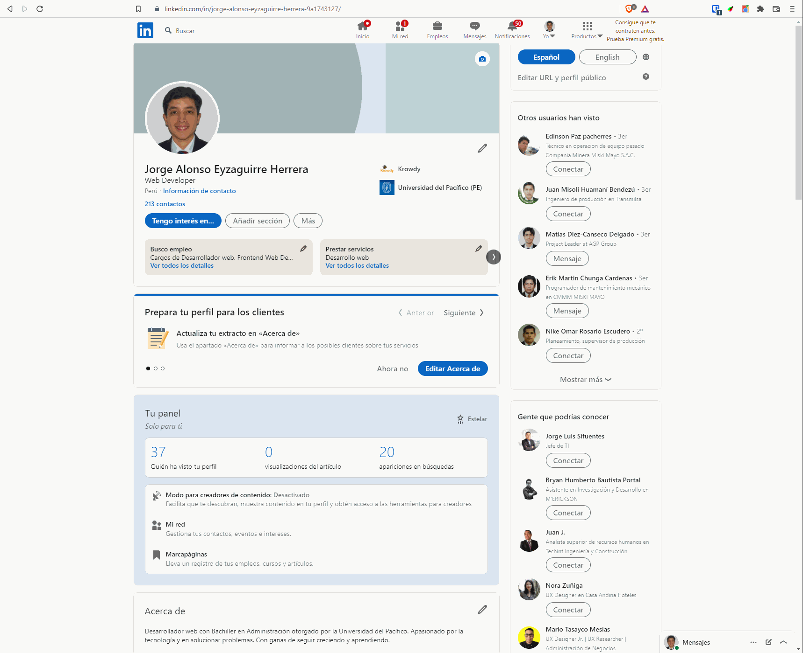

# LinkedIn Scraping Chrome Extension 

Add this chrome extension following these [instructions](https://developer.chrome.com/docs/extensions/mv3/getstarted/#manifest), go to a LinkedIn profile and run the extension. You will get a JSON object with the scraped data.

After running the scraper, click the 'Aceptar' button to send the scraped data to a local GraphQL server

## Note
Scraping may fail due to LinkedIn changing their web elements arrangement, classes or ids. In the best case scenario, you would only need to change the selectors to make it work again.

